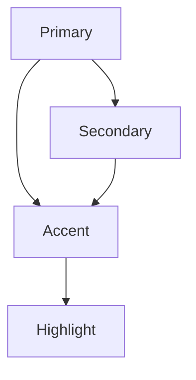

在现代 UI 系统里，「主色 primary」「次级色 secondary」以及「强调色 accent」构成了色彩体系的骨架。它们不仅是调色板上的几个代码，更关乎品牌识别、信息优先级与可用性。本篇结合 Pastel Palette 与 OKLCH 颜色空间实践，梳理三类色彩的职责与常见用法。

## 基本概念

{/* <Tag className="mb-2">Primary</Tag> */}
主色承载品牌感知，是用户最先联想到你的视觉符号。常用于：

- 核心按钮 / CTA（Call to Action）
- 关键信息强调，如当前导航、主要统计
- 品牌指示元素：Logo、品牌背景块

设计原则：

1. **保持稳定**：主色一旦选定，尽量避免频繁调整。
2. **兼顾可读性**：确保在明暗模式下都有足够对比度。
3. **与品牌调性匹配**：颜色要体现品牌个性，而非仅凭喜好选择。

{/* <Tag className="mb-2">Secondary</Tag> */}
次级色辅助主色，提供层级与对比。常见使用场景：

- 次要按钮、描边或标签。
- 分区背景（例如信息卡片、横幅）。
- 图表或数据视图中的辅助系列。

设计原则：

1. **与主色和谐**：通常与主色在色相上有适度差异，饱和度更低。
2. **保持辨识**：不能与灰阶或背景融为一体，要保持一定活力。
3. **发挥衬托作用**：不要过于张扬，以免抢了主色的视觉重心。

{/* <Tag className="mb-2">Accent</Tag> */}
强调色用于引起注意或表示状态，数量要少且精准。常见使用：

- 警示、成功等反馈（可扩展出一组状态色）。
- 交互组件 hover/active 的高亮。
- 视觉点睛：图表峰值、进度节点等。

设计原则：

1. **节制使用**：强调色应该保持稀缺性，才能真正吸睛。
2. **有明确语义**：例如 “Accent = 活力/提醒”，让用户快速建立联想。
3. **确保对比度**：强调色通常需要与背景形成高对比，避免误导。

## 三者协作模式

最常见的做法是 **Primary × Secondary 轴线** 确定基础视觉，Accent 作为局部点缀。这三者可以组成多个配色层级：

在 Pastel Palette 中，我们可以：

- 使用 `bg-primary`、`text-primary` 为 CTA、主按钮设色。
- 以 `bg-secondary`、`border-secondary` 为容器、徽章提供对比背景。
- 利用 `text-accent`、`bg-accent` 或状态色 `text-success` 等来提示结果。
